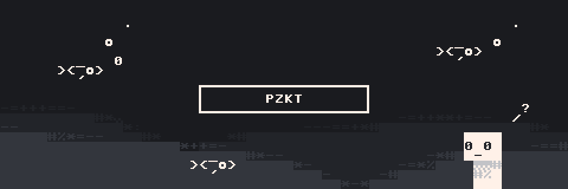

  

<h4 align="center">copyleft enjoyer | self-expression enthusiast | dreaming of digital sovereignty</h4>

 
 
I wish for a society that is designed to allow all its members the most autonomous action   
by means of tools least controlled by others. To that end, I really do believe that most of  
the time, the solution is less technology. To reduce and remove is a skill in itself.  
  
That shouldn't stop us from having a little fun  
while hacking away on our silly little projects, though :P  

